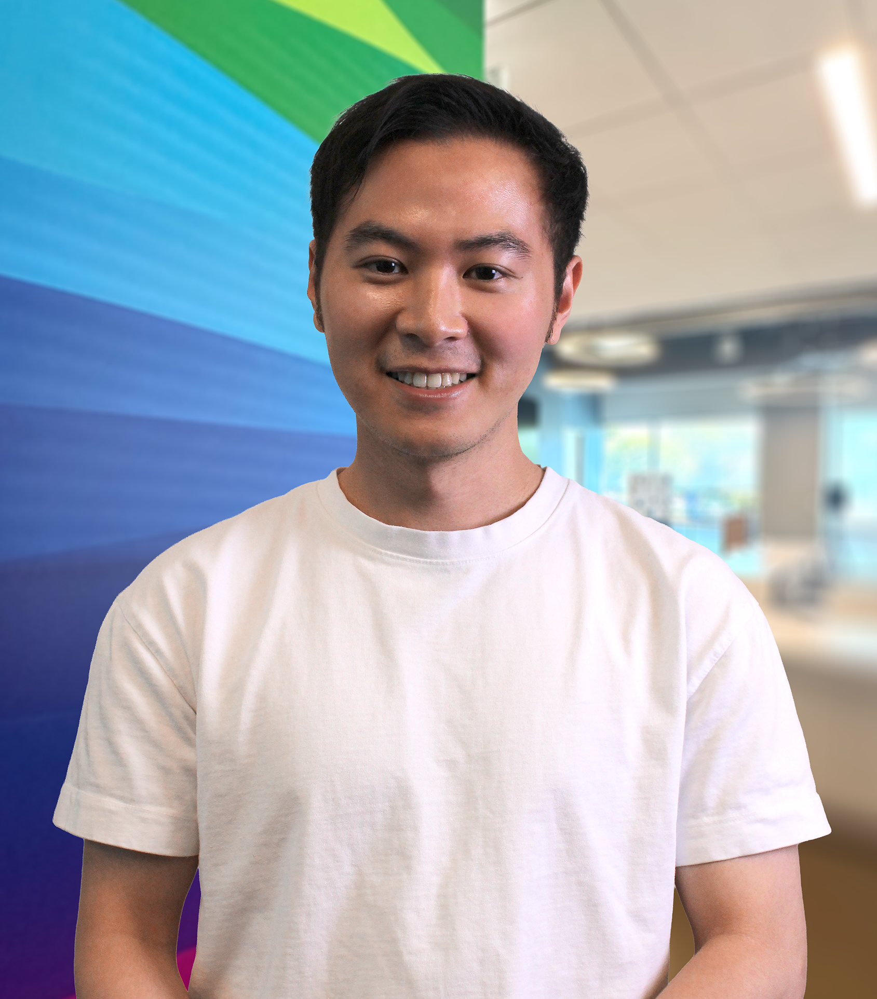

## About me

Hi! I am a 5th-year computer science & engineering (CSE) Ph.D. student at the University of Washington, advised by [Su-In Lee](https://aims.cs.washington.edu/su-in-lee) in the [Artificial Intelligence for Biological and Medical Sciences (AIMS)](https://aims.cs.washington.edu/) group. My research focuses on explainable and interpretable machine learning, particularly on attribution methods that decompose model behaviors into the contributions of different components, including individual features, samples, or data sources. I am also passionate about applying these techniques to accelerate real-world impact in domains such as healthcare and drug discovery.

Previously, I worked with [Li-wei Lehman](https://web.mit.edu/lilehman/www/), [Zach Shahn](https://sph.cuny.edu/about/people/faculty/zach-shahn/), and [Finale Doshi-Velez](https://finale.seas.harvard.edu/) at Harvard and MIT. I have spent summers interning at research labs in academia and industry: [Laboratory for
Computational Physiology](https://lcp.mit.edu/) at MIT, and [Bosch Research](https://www.bosch-ai.com/). I earned my MD from Kaohsiung Medical University and completed a master’s degree in Biomedical Informatics at Harvard Medical School’s Department of Biomedical Informatics.

I’ve been fortunate to work with many amazing people, and I’m always excited about new opportunities to collaborate. You can reach out to me at mingyulu[at]cs[dot]washington[dot]edu

## Recent update
* (April 2025) [SurrogateSHAP](https://arxiv.org/pdf/2601.22276) has been accepted to ICML 2026!
* (January 2026) New paper [SurrogateSHAP: Training-Free Contributor Attribution for Text-to-Image (T2I) Models](https://arxiv.org/pdf/2601.22276)!
* (September 2025) [CellCLIP – Learning Perturbation Effects in Cell Painting via Text-Guided Contrastive Learning](https://arxiv.org/abs/2506.06290) has been accepted to NeurIPS 2025!
* (June 2025) I will be working with [Suraj Srinivas](https://suraj-srinivas.github.io/) and [Jorge Piazentin Ono](https://jorgehpo.github.io/) at Bosch Research during the summer of 2025!

## Conference publications

- **SurrogateSHAP: Training-Free Contributor Attribution for Text-to-Image (T2I) Models**  
 **Mingyu Lu**, Soham Gadgil, Chris Lin, Chanwoo Kim, Su-In Lee  
 <em>International Conference on Machine Learning (ICML), 2026</em>  
 [[paper](https://arxiv.org/pdf/2601.22276)] [[code](https://github.com/suinleelab/SurrogateSHAP)]

- **CellCLIP – Learning Perturbation Effects in Cell Painting via Text-Guided Contrastive Learning**  
**Mingyu Lu**, Ethan Weinberger, Chanwoo Kim, Su-In Lee  
<em>Neural Information Processing Systems (NeurIPS), 2025</em>  
[[paper](https://arxiv.org/abs/2506.06290)] [[code](https://github.com/suinleelab/CellCLIP)] [[project page](https://q8888620002.github.io/CellCLIP-website/)]

-	**BehaviorSFT: Behavioral Token Conditioning for Clinical Agents Across the Proactivity Spectrum**  
Yubin Kim, Zhiyuan Hu, Hyewon Jeong, Eugene W Park, Shuyue Stella Li, Chanwoo Park, Shiyun Xiong, **MingYu Lu**, Hyeonhoon Lee, Xin Liu, Daniel McDuff, Cynthia Breazeal, Samir Tulebaev, Hae Won Park  
<em>Findings of Empirical Methods in Natural Language Processing (EMNLP), 2025</em>  
[[paper](https://arxiv.org/pdf/2505.21757)] [[code](https://drive.google.com/file/d/1ARra3jLP1nGTvkjitgW3m64YVzvxGr07/view)] [[project page](https://behavior-adaptation.github.io/)]  

- **An Efficient Framework for Crediting Data Contributors of Diffusion Models**  
Chris Lin\*, **Mingyu Lu**\*, Su-In Lee  
<em>International Conference on Learning Representations (ICLR), 2025</em>  
[[paper](https://arxiv.org/pdf/2407.03153)] [[code](https://github.com/q8888620002/Group-Attribution-for-Diffusion-Models)] [[project page](https://q8888620002.github.io/contributor-attribution/)]
  
- **Learning to Maximize Mutual Information for Dynamic Feature Selection**  
Ian Connick Covert, Wei Qiu, **MingYu Lu**, Na Yoon Kim, Nathan J White, Su-In Lee  
<em>International Conference on Machine Learning (ICML), 2023</em>  
[[paper](https://proceedings.mlr.press/v202/covert23a/covert23a.pdf)] [[code](https://github.com/q8888620002/dynamic-selection)]

- **G-Net: A Deep Learning Approach to G-computation for Counterfactual Outcome Prediction Under Dynamic Treatment Regimes.**  
Rui Li, Stephanie Hu, Yuria Utsumi, **MingYu Lu**, Prithwish Chakraborty, Daby Sow, Piyush Madan, Jun Li, Mohamed Ghalwash, Zachary Shahn, Li-wei H Lehman  
<em>Machine Learning for Health (ML4H), 2021</em>  
[[paper](https://arxiv.org/abs/2003.10551)]
  
- **Is Deep Reinforcement Learning Ready for Practical Applications in Healthcare? A Sensitivity Analysis of Duel-DDQN for Sepsis Treatment.**  
**MingYu Lu**, Zach Shah, Finale Doshi Velez, Li-Wei Lehman.  
<em>American Medical Informatics Association (AMIA), 2020 </em>  
**<em>Distinguished Paper</em>**  
[[paper](https://www.ncbi.nlm.nih.gov/pmc/articles/PMC8075511/)]

## Workshop and preprints
- **ALEX: Automatic Language EXplanations for Interpreting Treatment Effects via Multi-Agents**  
  **Mingyu Lu**, Chanwoo Kim, Nathan J. While, Su-In Lee  
  <em>medRxiv, 2026</em>  
  [[paper](https://www.medrxiv.org/content/10.64898/2026.04.23.26351510v1)]

- **Agent That Matters: An Attribution Framework for Multi-Agent LLMs**  
  **Mingyu Lu**\*, YuShan Huang\*, Su-In Lee  
  *Agents in the Wild: Safety, Security, and Beyond at ICLR, 2026*  
  [[paper](https://openreview.net/pdf?id=esabw9linR)]

- **MedBLINK:Probing Visual Perception and Trustworthiness in Multimodal Language Models for Medicine**  
Mahtab Bigverdi, Wisdom Oluchi Ikezogwo, Kevin Minghan Zhang, Hyewon Jeong, **MingYu Lu**, Sungjae Cho, Linda Shapiro, Ranjay Krishna  
<em>Computer Vision for Automated Medical Diagnosis (CVAMD) at ICCV, 2025</em>  
**<em>Oral presentation</em>**  
[[paper](https://www.arxiv.org/pdf/2508.02951)] [[project page](https://medblink-benchmark.github.io/)] [[hf dataset](https://huggingface.co/datasets/MahtabBg/MedBLINK)]

- **Tiered Agentic Oversight: A Hierarchical Multi-Agent System for AI Safety in Healthcare**  
Yubin Kim, Hyewon Jeong, Chanwoo Park, **MingYu Lu**, Eugene W Park, Haipeng Zhang, Xin Liu, Hyeonhoon Lee, Daniel McDuff, Cynthia Breazeal, Samir Tulebaev, Hae Won Park  
<em>Multi-Agent Systems (MAS) in the Era of Foundation Models at ICML, 2025</em>  
[[paper](https://arxiv.org/pdf/2506.12482)]

- **Medical Hallucination in Foundation Models and Their Impact on Healthcare**  
Yubin Kim, Hyewon Jeong, Shan Chen, Shuyue Stella Li, **Mingyu Lu**, Kumail Alhamoud, Jimin Mun, Cristina Grau, Minseok Jung, Rodrigo Gameiro, Lizhou Fan, Eugene Park, Tristan Lin, Joonsik Yoon, Wonjin Yoon, Maarten Sap, Yulia Tsvetkov, Paul Liang, Xuhai Xu, Xin Liu, Daniel McDuff, Hyeonhoon Lee, Hae Won Park, Samir Tulebaev, Cynthia Breazea  
<em>medRxiv, 2025</em>  
[[paper](https://arxiv.org/pdf/2503.05777)] [[code](https://github.com/mitmedialab/medical_hallucination)] [[project page](https://medical-hallucination2025.github.io/)] 

- **LIFT - XAI: Leveraging Important Features in Treatment Effects to Inform Clinical Decision-Making via Explainable AI**  
**Mingyu Lu**, Chanwoo Kim, Ian Covert, Nathan J. White, Su-In Lee  
<em>medRxiv, 2024</em>  
[[paper](https://www.medrxiv.org/content/10.1101/2024.09.04.24312866v3.full.pdf)]
  
- **A Deep Bayesian Bandits Approach for Anticancer Drug Screening: Exploration via Functional Prior.**  
**MingYu Lu**, Yifang Chen, Su-In Lee  
<em>Adaptive Experimental Design and Active Learning in the Real World Workshop at ICML, 2022</em>  
[[paper](https://realworldml.github.io/files/cr/paper62.pdf)]

## Leadership/Awards

Year | Leadership/Awards
-----|---------------
2020 | Organizer of NewInML at NeurIPS 2020 
2019 | LEAP Fellowship of the Ministry of Science and Technology of Taiwan. 
2017 | CoFounder of [TinyNote](https://thetinynotes.com/)

## Academic service

- **Conference reviewing**: NeurIPS (2024,2025), ICLR (2026), ICML (2026), ECCV (2026), AMIA (2020), CHIL (2020), ML4H@NeurIPS (2019,2020), DPFM@ICLR (2025,2026), LMRL@ICLR (2025)
